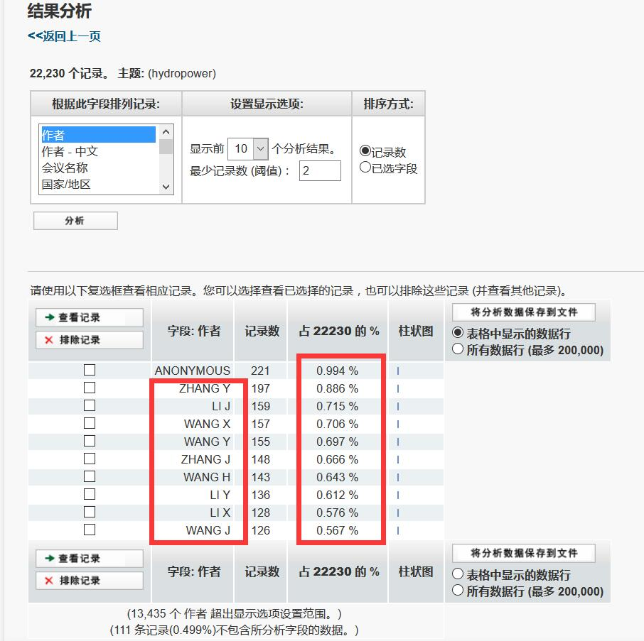
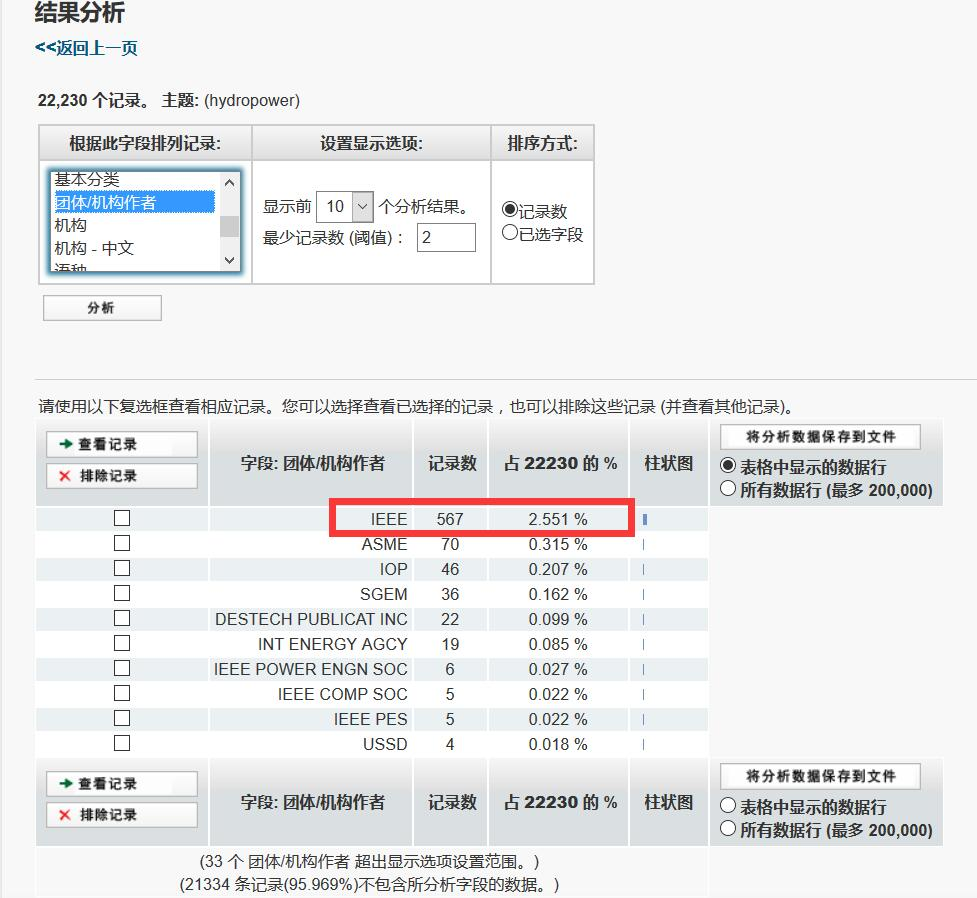
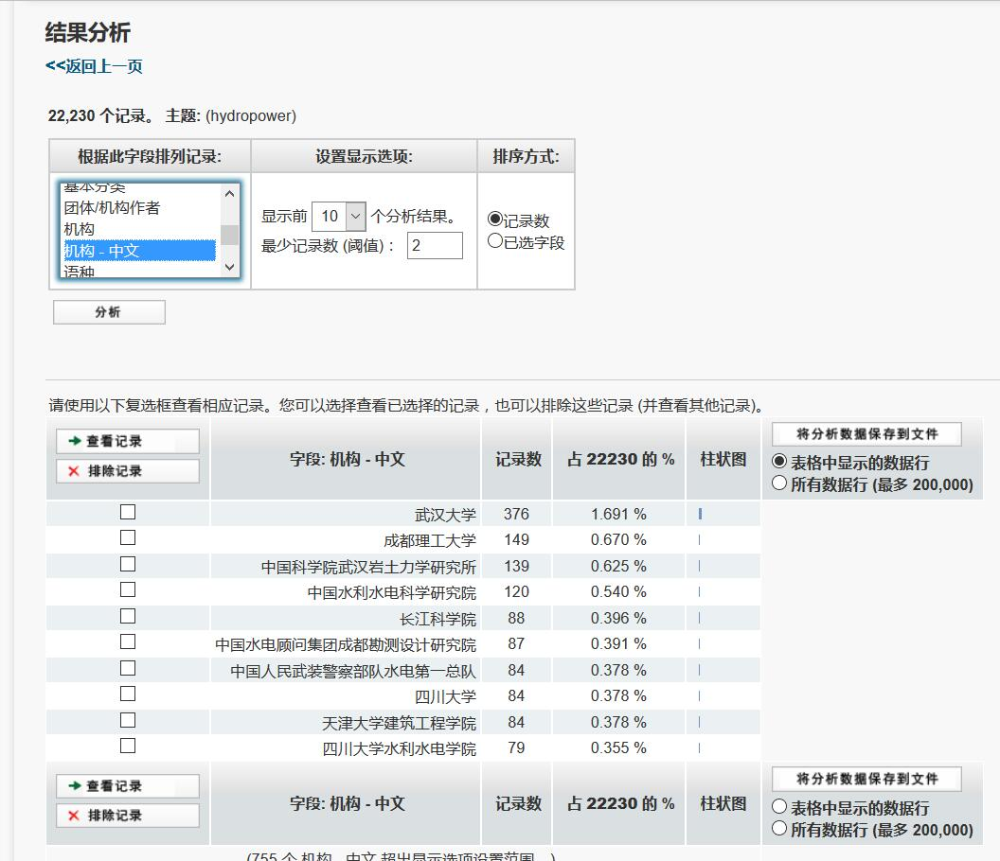
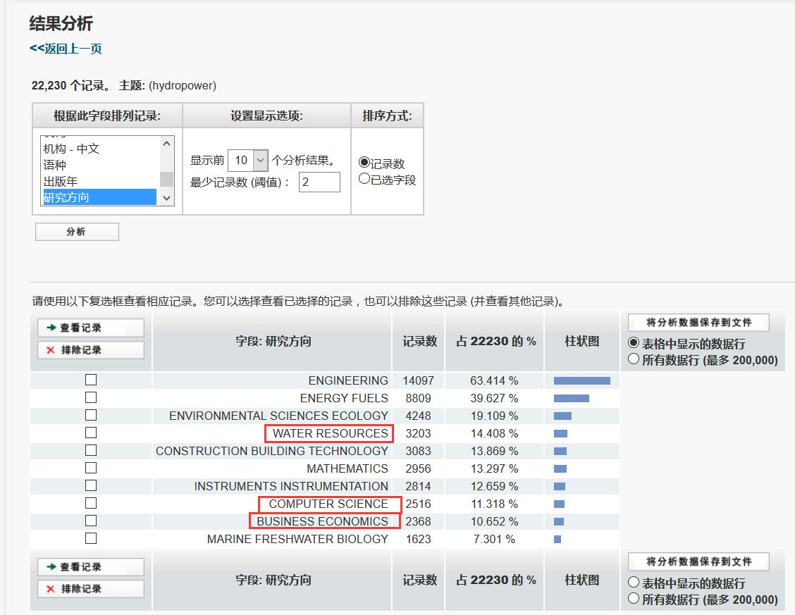
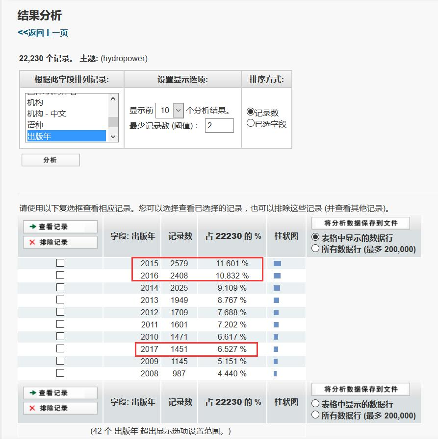
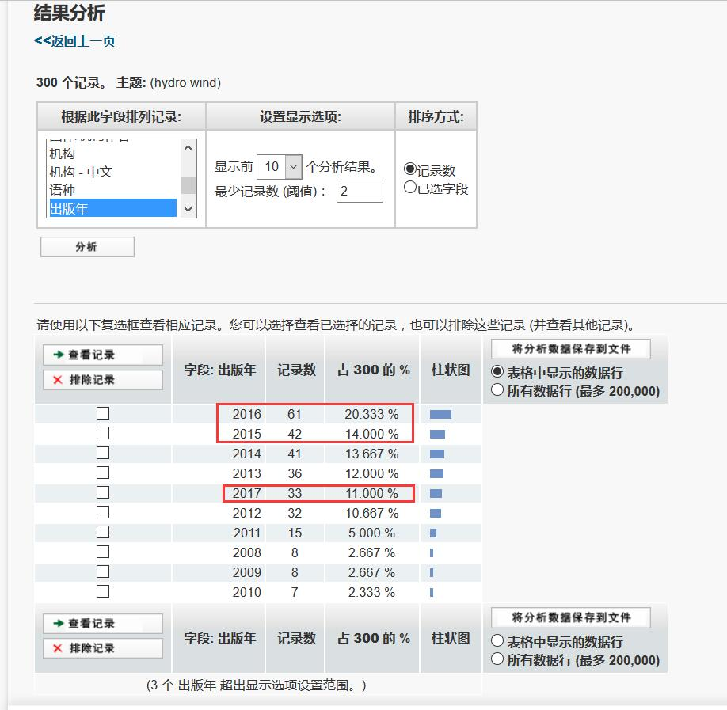

# 资料篇

## 行业论文分析
在Web Of Science 上检索hydropower，分别按照几种方式分类，得到以下的结果：
- 按地区分类
（好吧，为什么这个结果不能令人开心-_-）
- 按作者分类

2-10名，清一色我国学者
- 按发表机构分类

- 按机构分类

武大比较多
- 按研究方向

水资源方向的占到约14%
- 按年份

虽然2017年尚未结束，但是趋势上看，近两年的论文数量是下降的。

### 水电于其他能源多能互补方向
搜索风-水-调度关键字hydro-wind-scheduling，分析结果如下：
- 按年份

2016年最高，是近两年的热点，2017年份论文数量不算多。
- 按地区

我国和美帝论文数目比较多。
- 按机构电气方向较多

### 水电多目标方向
搜索关键字hydro-multiobject，分析结果如下：
- 按年份

- 按地区

