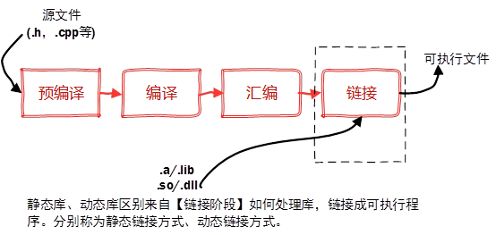

# CMake简介

C或C++程序的编译运行似乎总是让人觉得比较麻烦一些，这里就借了解CMake的机会，记录下这方面的基本知识。

## C++静态库与动态库

首先有必要了解一下库的意思。这部分主要参考：[C++静态库与动态库](https://www.runoob.com/w3cnote/cpp-static-library-and-dynamic-library.html)。

### 什么是库

库是写好的现有的，成熟的，可以复用的代码。现实中**每个程序都要依赖很多基础的底层库**，不可能每个人的代码都从零开始，因此库的存在意义非同寻常。

本质上来说库是一种**可执行代码的二进制形式**，可以被操作系统载入内存执行。库有两种：**静态库（.a、.lib）和动态库（.so、.dll）**。

所谓静态、动态是指链接。

一个程序编译成可执行程序的步骤：



### 静态库

之所以成为【静态库】，是因为在**链接阶段**，**会将汇编生成的目标文件.o与引用到的库一起链接打包到可执行文件中**。因此对应的链接方式称为静态链接。

静态库与汇编生成的目标文件一起链接为可执行文件，那么**静态库必定跟.o文件格式相似**。其实一个静态库可以简单看成是**一组目标文件（.o/.obj文件）的集合**，即很多目标文件经过压缩打包后形成的一个文件。

静态库特点:

-  静态库对函数库的**链接是放在编译时期完成**的。
-  程序在运行时与函数库再无瓜葛，**移植方便**。
-  **浪费空间和资源**，因为所有相关的目标文件与牵涉到的函数库被链接合成一个可执行文件。

Linux下使用**ar工具**、Windows下**vs使用lib.exe**，将目标文件压缩到一起，并且对其进行编号和索引，以便于查找和检索。一般**创建静态库的步骤**如图所示：


这里暂时只以linux下创建与使用静态库为例，实例参考了：[c++调用自己编写的静态库](https://blog.csdn.net/hao5335156/article/details/80282296)：

Linux静态库**命名规范**，**必须**是"lib[your_library_name].a"：lib为前缀，中间是静态库名，扩展名为.a。

首先，将代码文件编译成目标文件.o（StaticMath.o）：

``` code
g++ -c StaticMath.cpp
```

注意带参数-c，否则直接编译为可执行文件。

然后，通过ar工具将目标文件打包成.a静态库文件：

```code
ar -crv libstaticmath.a StaticMath.o
```

生成静态库libstaticmath.a。

大一点的项目会编写makefile文件（CMake等等工程管理工具）来生成静态库，输入多个命令太麻烦了。这个也是后面要记录的。接下来先使用下静态库。

Linux下使用静态库，只需要在**编译的时候**，**指定静态库的搜索路径**（-L选项）、**指定静态库名**（不需要lib前缀和.a后缀，-l选项）。

``` code
g++ TestStaticLibrary.cpp -L -lstaticmath
```

注意：

-  -L：表示要连接的库所在目录，因为这里在同一个文件夹下，所以就不必写相对路径了；
-  -l：指定链接时需要的动态库，编译器查找动态连接库时有隐含的命名规则，即在给出的名字前面加上lib，后面加上.a或.so来确定库的名称。

## CMake文件

### 如何使用第三方库

很多安装的软件，在代码编译运行的时候都会报错，比如include的文件找不到，链接库找不到等等。
这是因为如果编译软件使用了外部库，事先并不知道它的头文件和链接库的位置。
得在编译命令中加上包含它们的查找路径。CMake中可以使用 find_package 命令来解决这个问题，也可以借用第三方的pkg-config来解决。

#### find_package

可以通过命令 cmake --help-module-list 得到你的CMake支持的模块的列表。如果不在支持的列表中，
则需要自己定义 Find<name>模块，将其放入工程的某个目录中，通过 SET(CMAKE_MODULE_PATH dir)设置查找路径，供工程FIND_PACKAGE使用。

#### pkg-config

以netcdf为例。netcdf安装后，在其lib文件夹下有pkgconfig.
首先需要在环境变量中配置PkgConfig的路径。比如这里netcdf的安装路径是/usr/local。
对于Ubuntu系统，可以用root权限打开/etc/profile文件，然后输入以下代码：

```code
PKG_CONFIG_PATH=$PKG_CONFIG_PATH:/usr/local/lib/pkgconfig
export PKG_CONFIG_PATH
```

然后在CMakeLists.txt中写入以下语句，注意顺序很重要。

```code
find_package(PkgConfig REQUIRED)
# 需要在环境变量中配置好.pc文件的路径
pkg_check_modules(NETCDF REQUIRED netcdf)
pkg_search_module(NETCDF REQUIRED netcdf)

add_executable(LearnC simple_nc4_rd.c)

# add_executable要在link、include等之前，否则会报错
# 把对应的库文件加载进来
target_link_libraries(LearnC ${NETCDF_LIBRARIES})
# 把头文件包含进来
target_include_directories(LearnC PUBLIC ${NETCDF_INCLUDE_DIRS})
target_compile_options(LearnC PUBLIC ${NETCDF_CFLAGS_OTHER})
```
如果还报错，有库没加进来，可以手动添加绝对路径，比如报错：
error while loading shared libraries: libnetcdf.so.15: cannot open shared object file
则可以添加：
target_link_libraries(LearnC /usr/local/lib/libnetcdf.so.15)